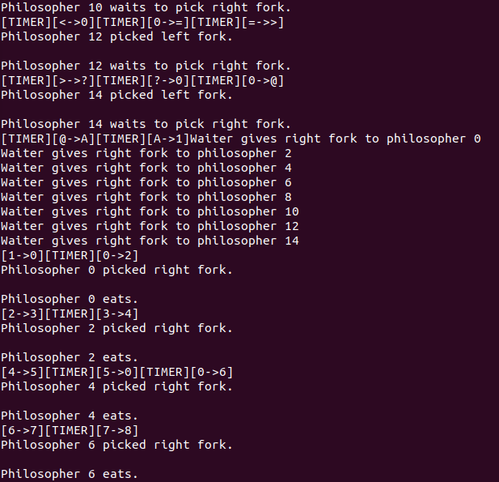
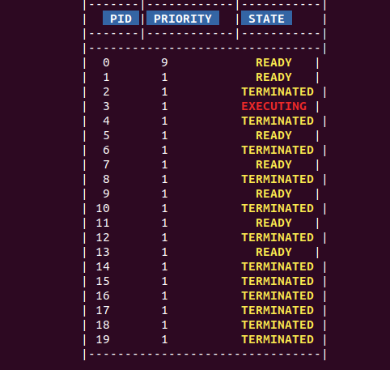

# QEMU-Kernel
 
 This is a project that involves developing an operating system kernel.
 Most of the development was made using C and inline assembly code.
 Features of the kernel include:
 -  Concurrent execution of processes using a pre-emptive multitasking algorithm
 -  Scheduler that can be customised to assign custom weightings to different programs
 -  Dynamic creation, execution and termination of programs using fork, exec and exit system calls
 -  A "dining philosophers" program that demonstrates mutual exclution and the correct implementation of the scheduler
 - Usage of the LCD and PS/2 controllers to create a simple UI to show running processes and the scheduler in action
 
 

